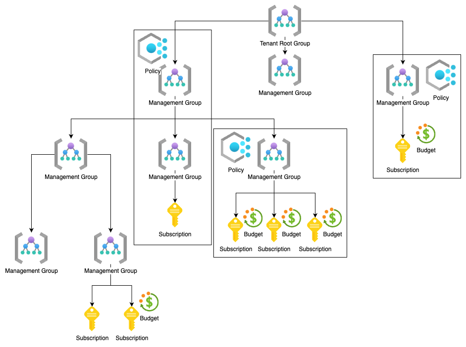

# Azure Landing Zone Module

### Purpose

This module allows to setup a Azure landing zone.

### Description

Using a combination of submodules management groups, policies, mca subscriptions and budgets you can create and scale organization zone with terraform.




### Example Usage
* Management Groups:
```
management_groups = [
    {
      display_name = "Management Group 1"
      children = [
        {
          display_name = "Management Group 2"
        },
        {
          display_name = "Management Group 3"
          children = [
            {
              display_name = "Management Group 4"
              children = [
                {
                  display_name = "Management Group 5"
                },
                {
                  display_name = "Management Group 6"
                }
              ]
            }
        }
      ]
    }
  ]
```

* Policies:
```
policies = {
    "Require specific tags on resources" = {
      policy_display_name = "Enforce specific tags on resources"
      policy_description  = "Enforce specific tags on resources"
      policy_type         = "Custom"
      policy_mode         = "All"

      policy_rule = jsonencode({
        "if" : {
          "anyOf" : [
            {
              "field" : "tags['Environment']",
              "exists" : "false"
            }
          ]
        },
        "then" : {
          "effect" : "deny"
        }
      })

      assignments = {
        "XXX Assignment" = {
          assignment_name        = "Require tag on resources"
          assignment_group       = "xxx"
          non_compliance_message = "ENVIRONMENT tag is required"
          non_scopes             = []
        },
        "XXX Assignment" = {
          assignment_name        = "Require tag on resources"
          assignment_group       = "xxx"
          non_compliance_message = "ENVIRONMENT tag is required"
          non_scopes = [
            "providers/Microsoft.Management/managementGroups/xxxxxxxx-xxxx-xxxx-xxxx-xxxxxxxxxxxx"
          ]
        }
      }
    }
  }
```

* Builtin policies:
```
builtin_policies = {
  "BUILTIN POLICY NAME" = {
    management_group_display_name     = "xxx"
    policy_definition_display_name    = "Allowed locations"
    assignment_name                   = "Sandboxes location no RG"
    assignment_display_name           = "Sandboxes location no RG"
    assignment_description            = "Block ability to use other location than eu-north"
    assignment_non_compliance_message = "All resources have to be of location eu-north"
    assignment_parameters = {
      "listOfAllowedLocations" : {
        "value" : ["North Europe"]
      }
    }
    assignment_non_scopes = []
  }
}
```

* Subscriptions and budgets:
```
subscriptions = {
    "SubName" = {
      subscription_name            = "DevOps Sandbox"
      billing_account_name         = "xxxxxxxx-xxxx-xxxx-xxxx-xxxxxxxxxxxx:xxxxxxxx-xxxx-xxxx-xxxx-xxxxxxxxxxxx_2019-05-31"
      billing_profile_name         = "xxxxxxxx-xxxx-xxxx-xxxx-xxxxxxxxxxxx"
      invoice_section_name         = "xxxx-xxxx-xxx-xxx"
      parent_management_group_name = "Sandboxes"
      budget_name                  = "Budget"
      budget_amount                = 100
      budget_time_grain            = "BillingMonth"
      budget_start_date            = "2022-12-01"
      budget_end_date              = "2023-12-01"
      budget_notifications = [
        {
          enabled        = true
          threshold      = 85
          operator       = "EqualTo"
          threshold_type = "Actual"
          contact_emails = [
            "xxx"
          ]
        },
        {
          enabled        = true
          threshold      = 85
          operator       = "EqualTo"
          threshold_type = "Forecasted"
          contact_emails = [
            "xxx"
          ]
        }
      ]
    }
  }
```

### Inputs

| Name | Description | Type  | Default | Required |
| :-------- | ------- | :----: | :-------: | :----: |
| management_groups | A list of Management Groups with their children. Maximum nesting is limited to 6 levels. | list(any)   | n/a |    Yes    |
| subscriptions | A list of subscription configurations. | map(any) | n/a | Yes
| policies | A list of policies and their assignment configuration. | map(any) | n/a  | Yes
| builtin_policies | A list of builtin policies and their assignment configuration. | map(any) | n/a  | Yes


#### Outputs

none